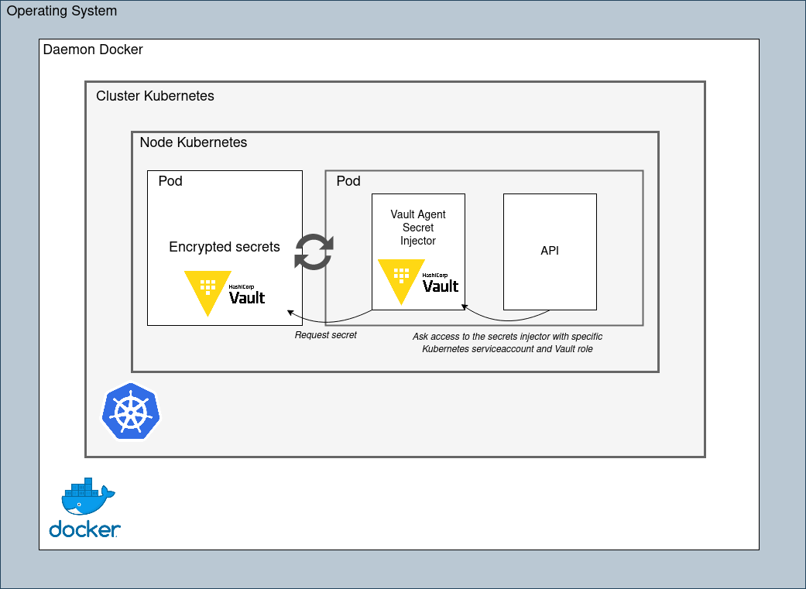

# Vault Sidecar Secret Injection

This repository shows you how to inject secrets in you application from Hashicorp Vault in Kubernetes

:warning: Never transform encrypted variable from Vault in base64 encoded data for sensitive values. You may prefer inject your sensitive values directly in pod where they are needed.

## Prerequisites


## How it works



## How to


1. Create cluster | Install Vault Helm chart

    ```bash
    make start
    ```

2. Build Golang api and push docker image

    ```bash
    make image
    ```

3. Create secret, kubernetes authentication, policies and roles in Vault

    ```bash
    make vault
    ```

4. Deploy Helm chart

    ```bash
    make api
    ```

5. Create port forward with application container

    ```bash
    make forward
    ```

6. Now, you can request http://localhost:8080

    ```json
    {
        "APP_ENV_SECRET":"my_secure_secret",
        "APP_ENV_VALUE":"production",
        "HOME":"/home/nonroot",
        "HOSTNAME":"api-deployment-78c847444f-5wmgl",
        "OS_RELEASE":"NAME=\"Alpine Linux\"\nID=alpine\nVERSION_ID=3.18.2\nPRETTY_NAME=\"Alpine Linux v3.18\"\nHOME_URL=\"https://alpinelinux.org/\"\nBUG_REPORT_URL=\"https://gitlab.alpinelinux.org/alpine/aports/-/issues\"\n"
    }
    ```

## Cleanup your system

1. delete everything in your system about this project
    ```bash
    make cleanup
    ```
